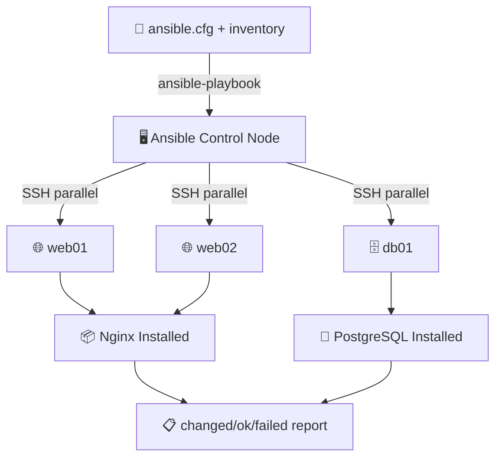

# 🤖 Ansible Playbook Builder
> **Deploy applications instantly. Generate highly structured system updates, secure installation recipes, and customized role parameters in YAML syntax.**

[](https://pradeeptalari14.github.io/portfolio/tools/ansible/)
[]()

---

## 🎛️ Studio Options — What the UI Generates

The studio has multiple configurable options. Each combination produces different output files.
This repository contains **one working example per option variant** so you can learn by diffing.

### Output Tabs (files the studio generates)
| Tab | Description |
|-----|-------------|
| `playbook.yml` | Generated in studio Output tab |
| `inventory/hosts` | Generated in studio Output tab |
| `role tasks` | Generated in studio Output tab |
| `ansible.cfg` | Generated in studio Output tab |
| `Flow Diagram` | Generated in studio Output tab |

### Configurable Options
| Option | Available Values |
|--------|-----------------|
| **Target** | `Web Server (Nginx)` / `Database (PostgreSQL)` / `Kubernetes Node` / `Full Stack` |
| **OS** | `Ubuntu 22.04` / `RHEL 9` / `Amazon Linux 2023` |
| **Firewall** | `UFW` / `firewalld` / `none` |
| **Extra: fail2ban** | `yes` / `no` |
| **Extra: SSL cert** | `yes` / `no` |

---

## 🏗️ Architecture Flow Diagram



---

## 📁 Repository Structure

```
tp-ansible/
├── README.md          ← This file — complete learning guide
├── playbook.yml
├── inventory/hosts.ini
├── roles/common/tasks/main.yml
├── roles/webserver/tasks/main.yml
├── roles/postgres/tasks/main.yml
├── ansible.cfg
├── group_vars/all.yml
├── scripts/           ← Deployment + validation helpers
└── docs/USAGE.md      ← Extended usage guide
```

---

## ⚡ Quick Start

### Step 1 — Generate files from the Studio
1. Open **[Ansible Playbook Builder Studio](https://pradeeptalari14.github.io/portfolio/tools/ansible/)**
2. Select your option values in the UI
3. Watch the output update live in the editor
4. Click **Download** or **Copy** for each tab

### Step 2 — Use the example files in this repo
```bash
git clone https://github.com/Pradeeptalari14/tp-ansible.git
cd tp-ansible
# Browse examples/ to find the variant matching your needs
# Copy the relevant files into your project
```

---

## 🔄 Complete Start-to-End Workflow


---

## 📖 How Each Option Changes the Output

### Target
- **`Web Server (Nginx)`** — see `examples/` folder for generated output
- **`Database (PostgreSQL)`** — see `examples/` folder for generated output
- **`Kubernetes Node`** — see `examples/` folder for generated output
- **`Full Stack`** — see `examples/` folder for generated output

### OS
- **`Ubuntu 22.04`** — see `examples/` folder for generated output
- **`RHEL 9`** — see `examples/` folder for generated output
- **`Amazon Linux 2023`** — see `examples/` folder for generated output

### Firewall
- **`UFW`** — see `examples/` folder for generated output
- **`firewalld`** — see `examples/` folder for generated output
- **`none`** — see `examples/` folder for generated output

### Extra: fail2ban
- **`yes`** — see `examples/` folder for generated output
- **`no`** — see `examples/` folder for generated output

### Extra: SSL cert
- **`yes`** — see `examples/` folder for generated output
- **`no`** — see `examples/` folder for generated output

---

## 🔐 Security Best Practices

- ❌ Never commit credentials, API keys, or passwords
- ✅ Use environment variables or secret managers (Vault, AWS SSM, GitHub Secrets)
- ✅ Enable branch protection: require PR reviews + CI status checks
- ✅ Rotate credentials regularly and use least-privilege

---

## 📖 Resources

| Resource | Link |
|----------|------|
| Interactive Studio | [Open →](https://pradeeptalari14.github.io/portfolio/tools/ansible/) |
| All 91 Studios | [Dashboard →](https://pradeeptalari14.github.io/portfolio/tools/) |
| SRE Provisioning Guide | [Handbook →](https://github.com/Pradeeptalari14/portfolio/blob/main/GITHUB_PROVISIONING_GUIDE.md) |

---
*Generated by [Ansible Playbook Builder Studio](https://pradeeptalari14.github.io/portfolio/tools/ansible/) — [Talari Pradeep Portfolio](https://pradeeptalari14.github.io/portfolio)*